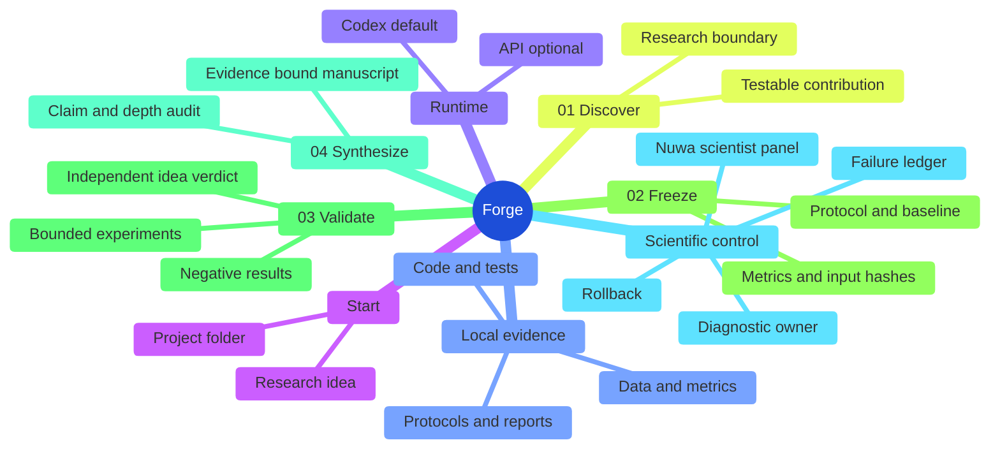

<p align="center">
  
</p>

<h1 align="center">Research Forge</h1>

<p align="center"><strong>Give it a project folder. Get an evidence-bound paper—or a precise reason you cannot write one yet.</strong></p>

<p align="center">
  Project → Evidence → Verdict → Paper
</p>

<p align="center">
  
  
  
  <a href="https://github.com/CKwin26/Auto-Agentic-Research-Forge/stargazers"></a>
</p>

<p align="center">
  <a href="#-quick-start">Quick start</a> ·
  <a href="#-what-makes-it-different">Why Research Forge</a> ·
  <a href="#-four-stage-loop">How it works</a> ·
  <a href="#-verified-record">Verified record</a> ·
  <a href="#-documentation">Documentation</a> ·
  <a href="#中文简介">中文</a>
</p>

<p align="center"><sub>Editorial digital-human artwork—not a historical photograph or endorsement.</sub></p>

---

## ⚡ One folder. One governed paper.

```powershell
# Open the local research workspace
& .\.venv\Scripts\python.exe main.py web --open

# Or close the four-stage loop from the CLI
& .\.venv\Scripts\python.exe main.py bundle close-loop "C:\path\to\project" --track auto
```

The default UI starts with **I already have a project**. Select a local folder containing code, data, protocols, tests, or reports. Research Forge reads the source project without modifying it and writes every generated artifact to a separate run directory.

You can switch the same page to **idea to paper** when no project exists yet.

## 🤔 What is Research Forge?

Research Forge is a local-first agentic research platform for two starting points:

| Start with | Research Forge does |
|---|---|
| **An existing project** | Finds the strongest paper-worthy boundary already supported by its resources. |
| **An early idea** | Converges the idea into a testable question before paper writing begins. |

The core rule is simple:

> **The research verdict and the paper-writing verdict are independent.** A polished manuscript cannot turn an unsupported idea into a supported one.

Codex handles bounded reasoning. Deterministic Python owns evidence, hashes, budgets, gates, state transitions, side effects, and final audit decisions.

## 🧠 What makes it different

| Capability | Why it matters |
|---|---|
| **Real local resources** | Selected code, data, protocols, tests, and reports define the research boundary. |
| **Two end-to-end entry points** | Project-to-paper is the default; idea-to-paper uses the same governed workspace. |
| **Evidence before prose** | The idea verdict, protocol binding, numeric results, literature, and manuscript readiness remain separate. |
| **Scientist-panel review** | Feynman-, Tukey-, Shannon-, and Popper-inspired personas challenge claims under deterministic veto and abstention rules. |
| **Fault ownership** | `diagnostic_owner` distinguishes idea failure, evidence gaps, literature gaps, and writer failure. |
| **Rollback instead of restart** | The failure ledger identifies the earliest preventable stage and reruns only affected downstream work. |
| **Codex first, API optional** | Local Codex authentication is the default; an explicit API backend is available for server deployments. |

> [!IMPORTANT]
> Persona review is a same-model supplemental audit. It is not independent human validation.

## 🚀 Quick start

Windows PowerShell:

```powershell
git clone https://github.com/CKwin26/Auto-Agentic-Research-Forge.git
Set-Location .\Auto-Agentic-Research-Forge

python -m venv .venv
& .\.venv\Scripts\python.exe -m pip install -e ".[dev]"
& .\.venv\Scripts\python.exe main.py doctor
& .\.venv\Scripts\python.exe main.py web --open
```

For an existing project:

```powershell
$py = ".\.venv\Scripts\python.exe"

& $py main.py bundle inspect "C:\path\to\project"
& $py main.py bundle close-loop "C:\path\to\project" `
  --output-root bundle_runs `
  --track auto
```

The source folder remains read-only. The run snapshots only selected, supported resources and excludes credentials, `.env*`, private keys, virtual environments, package caches, build directories, and oversized files.

## 🔬 Four-stage loop

| Stage | Question | Durable result |
|---|---|---|
| **01 Discover** | What is the narrowest testable contribution? | Research boundary and resource manifest |
| **02 Freeze** | What protocol, baseline, metrics, budget, and inputs define the test? | Immutable evidence contract |
| **03 Validate** | What does the bound evidence actually say? | Independent `idea_verdict.json` |
| **04 Synthesize** | What manuscript can that evidence support? | Claims, working paper, audit, and next blocker |



## 📦 What you get

```text
bundle_runs/<run-id>/
  stage_1_discovery/       # selected resources and research boundary
  stage_2_protocol/        # frozen protocol/evidence lock
  stage_3_experimentation/ # idea_verdict.json and bound results
  stage_4_synthesis/       # claims, manuscript, expansion plan, audits
  completion_certificate.json
```

| Signal | Meaning |
|---|---|
| `pilot_draft_generated=true` | The four-stage diagnostic loop closed. It does not mean the paper is ready. |
| `paper_expansion_plan.ready=true` | The idea, protocol-output binding, numeric evidence, and verified literature passed the expansion gate. |
| `paper_draft_ready=true` | The expanded manuscript passed depth, citation, numeric-preservation, and conclusion-binding audits. |
| `publication_ready=true` | External novelty review, independent human review, venue formatting, authorship, and submission approval are complete. |

Full-paper expansion requires a clean prospective idea verdict, exact protocol-output binding, at least 15 bound numeric results, and at least 15 frozen verified papers. See the [project-bundle workflow](docs/project-bundle-workflow.md).

## ✅ Verified record

The first protected closed-loop study is pipeline-complete under frozen protocol `stage2-22e124e44294`:

| Evidence | Result |
|---|---|
| Literature | 138 normalized candidates → 22 exact screens → 12 verified papers |
| Experiment | 18 protected evaluations across paired baseline and treatment cells |
| Unsupported-claim rate | `30.56%` baseline → `8.33%` treatment |
| Cost | Treatment runtime was `65.90%` higher |
| Honest boundary | Human validation remains deferred; the paper is not publication-ready |

Read the [Stage 1 record](docs/real-stage1-2026-07-17.md), [protected evaluation](docs/stage2-protected-evaluation-2026-07-18.md), and [Stage 4 closure record](docs/stage4-provisional-closed-loop-2026-07-18.md).

## 📚 Documentation

| Guide | Use it for |
|---|---|
| [Project-bundle workflow](docs/project-bundle-workflow.md) | Turn an existing folder into an evidence-bound working paper |
| [Four-stage contract](docs/four-stage-closed-loop.md) | Stage ownership, transitions, and rollback rules |
| [Stage 1 literature workflow](docs/stage1-literature-workflow.md) | Search, verification, novelty mapping, and human approval |
| [Publication-readiness contract](docs/publication-readiness-contract.md) | Venue targeting and scientific hard gates |
| [RF-Bench](docs/benchmark.md) | Deterministic and Codex-driven benchmark loops |
| [Design notes](docs/design-notes.md) | Architecture decisions and borrowed patterns |

Run `python main.py --help` for the complete CLI, including literature, experiment, synthesis, localization, venue, recovery, and benchmark commands.

## 中文简介

<details>
<summary><strong>展开中文说明</strong></summary>

Research Forge 默认从一个本地项目文件夹开始：只读分析代码、数据、协议、测试和报告，自动收敛可验证的论文方向，再依次完成发现、冻结、验证和综合四个阶段。

它的核心不是“无论如何都写出一篇论文”，而是先回答两个彼此独立的问题：

1. 这个想法是否被项目证据支持？
2. 当前证据是否足以生成一篇合格论文？

如果想法成立但论文失败，责任落在证据包装、文献或写作阶段；如果想法本身不成立，则不会用更漂亮的文字掩盖失败。故障账本会定位最早可预防阶段，补证据后只重跑受影响的下游步骤。

人格化科学家面板用于补充审核，不冒充真人或跨模型独立评审。Codex 负责受约束的推理，确定性程序负责证据、门禁、预算、溯源和副作用。

</details>

---

Research Forge is a runnable research-engineering MVP—not a universal autonomous scientist. A completed pipeline is not the same as a publishable paper.
