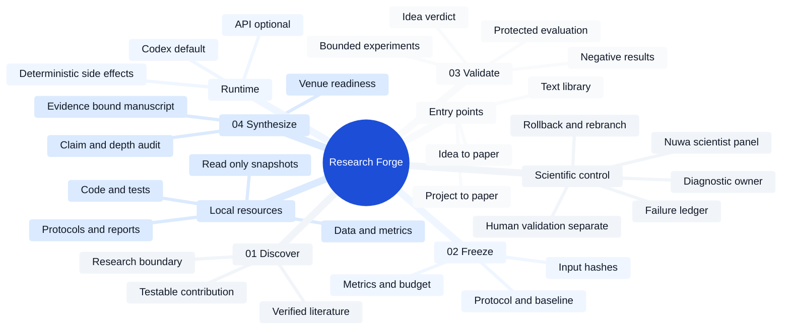
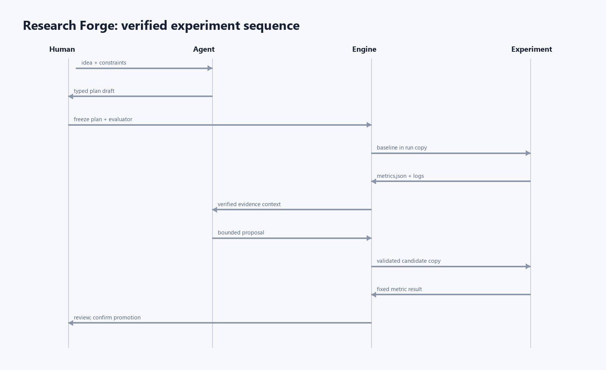
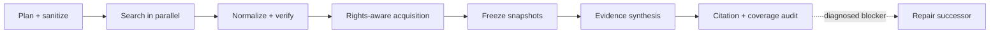
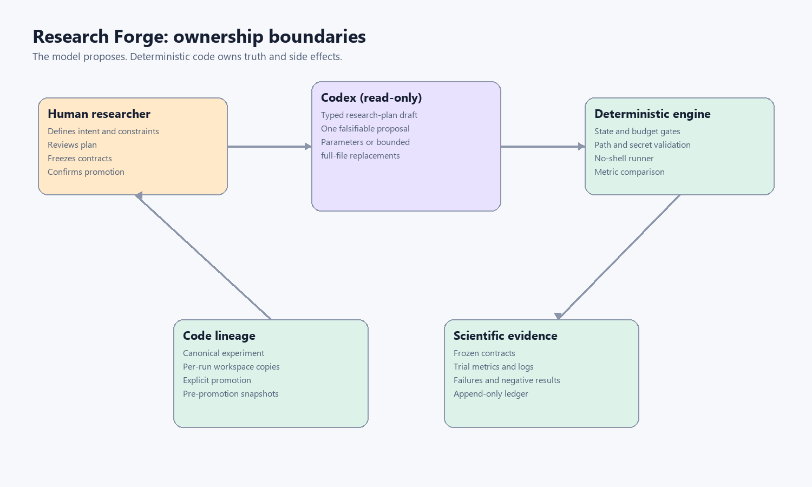

<p align="center">
  
</p>

<h1 align="center">Research Forge</h1>

<p align="center"><strong>Turn a local project into an evidence-bound scientific paper.</strong></p>

<p align="center">
  Local-first agentic research with deterministic gates, traceable evidence, scientist-panel review, fault localization, and rollback.
</p>

<p align="center">
  
  <a href="https://github.com/CKwin26/Auto-Agentic-Research-Forge/actions/workflows/ci.yml"></a>
  
  <a href="https://github.com/CKwin26/Auto-Agentic-Research-Forge/stargazers"></a>
</p>

<p align="center">
  <a href="#why-research-forge">Why Research Forge</a> ·
  <a href="#four-stage-closed-loop">How it works</a> ·
  <a href="#external-research-engine">External research</a> ·
  <a href="#quick-start">Quick start</a> ·
  <a href="docs/project-bundle-workflow.md">Project bundles</a> ·
  <a href="docs/benchmark.md">RF-Bench</a>
</p>

<p align="center"><sub>Editorial digital-human artwork—not a historical photograph or endorsement.</sub></p>

Research Forge is a local-first agentic research platform for two starting points: an early research idea, or an existing folder containing code, data, protocols, tests, and reports. It narrows the research boundary, freezes the evidence contract, runs bounded validation, and writes only what the evidence can support.

> [!IMPORTANT]
> **Codex proposes. Deterministic code owns truth, gates, budgets, provenance, and side effects.** A polished manuscript cannot upgrade a weak idea or repair missing evidence by prose alone.

> [!NOTE]
> **Public-default update — 2026-07-20.** Research Forge is now a reusable research-control system, not a wrapper around one reference paper. This update keeps every existing entry point and gate, and adds: (1) an explicit `ProjectSpec` plus a four-stage pipeline manifest; (2) hard-coded stage/skill/role contracts, bounded prompt envelopes, append-only failure memory, and graceful degradation for optional reasoning steps; (3) persisted, independently aggregated scientist-style review opinions as a supplemental audit layer—not human validation or cross-model independence; and (4) a second unrelated SICK lexical replication scaffold that exercises the generic contracts without modifying the research core. The second case is deliberately non-publication-ready until its controlled-environment and literature gates are independently met. See the [productization contract](docs/productization-contract.md), [hard-code audit](docs/hardcode-audit-2026-07-20.md), and [second-case scaffold](case_studies/sick-lexical-replication-v1/README.md).

Create and inspect the reusable governance manifest before beginning a new project:

```powershell
$py = ".\.venv\Scripts\python.exe"
& $py main.py pipeline initialize ".\workspaces\my-project" `
  --spec ".\examples\project-specs\tabular-imputation-replication.json"
& $py main.py pipeline inspect ".\workspaces\my-project"
```

## Why Research Forge

| Capability | What it changes |
|---|---|
| **Use your real project bundle** | Read-only ingestion turns selected local code, datasets, protocols, tests, and reports into the explicit research boundary. |
| **Dual-channel claim discovery** | Hashed author statements are matched with RedFox and scholarly attention signals to recommend validation targets; trends rank opportunities but never count as scientific evidence. |
| **Closed-loop external research** | Policy-controlled academic, web, code, model and dataset retrieval is normalized, rights-checked, frozen, synthesized and citation-audited across the same four phases. |
| **Idea-to-paper and project-to-paper** | Both entry points use the same governed research workspace instead of separate demo flows. |
| **Evidence before prose** | Idea verdicts, protocol-output binding, numeric results, and frozen literature remain independent from manuscript generation. |
| **Scientist-panel review** | The bundled [Nuwa Scientist Panel](skills/nuwa-scientist-panel/SKILL.md) runs blinded Feynman-, Tukey-, Shannon-, and Popper-inspired reviews with deterministic veto and abstention rules. |
| **Fault ownership** | `diagnostic_owner` separates failures in idea validation, evidence packaging, literature grounding, and paper writing. |
| **Rollback and repair** | Append-only failure ledgers identify the earliest preventable stage, produce a repair contract, and rerun only affected downstream stages. |
| **Editable scientific diagrams** | Workflow and architecture figures are authored as editable draw.io sources, exported through the local draw.io CLI, and hash-bound to the manuscript artifact manifest. |
| **Codex without a separate API key** | The default backend reuses local ChatGPT/Codex authentication; an explicit API backend remains available for server deployments. |

## Four-stage closed loop

| 01 — Discover | 02 — Freeze | 03 — Validate | 04 — Synthesize |
|---|---|---|---|
| Inspect the selected project resources and converge a testable contribution. | Bind literature, protocol, baseline, metrics, budgets, and immutable inputs. | Run bounded experiments, protected evaluation, negative-result capture, and idea verdict. | Generate an evidence-bound working paper, audit claims and depth, then route publication blockers upstream. |

### System mind map



<p align="center">
  
</p>

The paper is downstream of the research verdict. Stage 4 can report that an idea is unsupported or that evidence is incomplete; it cannot rewrite Stage 3 into a success. See [the four-stage contract](docs/four-stage-closed-loop.md).

## External research engine

External retrieval is shared infrastructure—not a fifth phase. One persistent
DAG connects policy-controlled search, metadata and license checks, lawful
full-text acquisition, immutable snapshots, evidence-bound synthesis, citation
auditing and bounded repair.



Supported public sources include scholarly metadata/search, Codex-native web
search, GitHub, Hugging Face and open-access resolution. The default network
policy is offline; enabling providers requires explicit owner approval.
Discovery signals and search rankings can propose directions but never decide
the scientific verdict.

For an existing Workflow v2 Study:

```powershell
research-forge --workflow-root .rfab/workflow-v2 retrieval workflow-run `
  --study-id <study-id> --stage all --run-key public-loop-v1 --plan-only
```

The complete design, policy command, resume semantics and verification steps
are documented in the [External Research closed loop](docs/external-research-closed-loop.md).

## Review, diagnosis, and rollback

<p align="center">
  
</p>

Persona review is a **same-model supplemental audit**, not human validation or cross-model independence. Deterministic aggregation preserves vetoes and abstentions; root-cause preflight then maps each blocker to its owning stage and the evidence needed to resume the loop.

<details>
<summary><strong>中文简介</strong></summary>

- **本地资源定向研究**：只读导入项目包或文本资料库，把真实代码、数据、协议、测试和报告作为研究边界。
- **双入口端到端平台**：支持“想法到论文”和“项目生成论文”，共同使用发现、冻结、验证、综合四阶段闭环。
- **人格蒸馏科学家审核**：以费曼、图基、香农和波普尔式公开方法盲审，并由确定性规则聚合；不冒充真人审核。
- **故障责任定位**：区分想法验证、证据包装、文献支撑和论文写作问题，避免把想法失败误诊为 Agent 失败。
- **回滚补证据**：保留失败账本，定位最早可预防阶段，补充证据后只重跑受影响的下游步骤。
- **Codex 默认、API 可选**：默认复用本地 ChatGPT/Codex 登录，也可显式切换 API 后端。

</details>

## Quick start

```powershell
git clone https://github.com/CKwin26/Auto-Agentic-Research-Forge.git
Set-Location .\Auto-Agentic-Research-Forge
python -m venv .venv
& .\.venv\Scripts\python.exe -m pip install -e ".[dev]"
& .\.venv\Scripts\python.exe main.py doctor
& .\.venv\Scripts\python.exe main.py web --open
```

The web interface defaults to **I already have a project** and lets users switch in place to **idea to paper**. Source projects are read-only; generated runs and evidence packages live in separate working directories.

## Verified research record and publication gates

The first release closes all four macro stages: source-backed discovery, frozen protocol and baseline, bounded automated experimentation, and evidence-bound synthesis. Paper drafting is intentionally downstream of verified evidence rather than the first demo surface. See [the four-stage contract](docs/four-stage-closed-loop.md).

Research Forge can also ingest an existing project folder or text library read-only. It prefers complete protocol-output-report chains. When none exists, it derives a provisional research boundary from readable project materials, runs all four macro stages, and structurally keeps the idea verdict `unverifiable` until a frozen protocol and bound experiment output are supplied. Every path snapshots the exact resources used, writes `idea_verdict.json` independently of the manuscript, and generates an evidence-gap working paper. See [the project-bundle workflow](docs/project-bundle-workflow.md).

The first live scientific Stage 1 is complete: six queries produced 138 normalized candidates, 22 received exact semantic-screening decisions, 12 verified papers were approved, and `novelty-02` became a freeze-ready 18-run paired-ablation plan. All 23 Stage 1 checks pass, including exact review approval and plan/review/source hash binding. See [the verified Stage 1 record](docs/real-stage1-2026-07-17.md).

The preregistered paired Stage 2 study is now pipeline-complete under frozen protocol `stage2-22e124e44294`: nine no-gate baseline cells, nine gated treatment cells, all 18 protected evaluations, a 13-claim evidence registry, deterministic Markdown and LaTeX manuscripts, a passing synthesis audit, and a hash-bound completion certificate. The protected automated evaluator estimated unsupported-claim rates of `30.56%` for baseline and `8.33%` for treatment, with a 10,000-resample hierarchical bootstrap interval of `[-0.4167, -0.0833]`; treatment runtime was `65.90%` higher. Human validation remains explicitly deferred, so the paper is pipeline-complete but not publication-ready. See [the Stage 2 evaluation record](docs/stage2-protected-evaluation-2026-07-18.md) and [the Stage 4 closure record](docs/stage4-provisional-closed-loop-2026-07-18.md).

The root-cause preflight now separates manuscript symptoms from upstream design failures. It traces review concerns to the metric contract, protocol design, execution telemetry, synthesis contract, or review routing; computes the maximum defensible claim tier; and blocks publication routing when a critical cause remains open. New Stage 2 freezes persist this deterministic analysis before any cell runs. For an existing paired study:

```powershell
& .\.venv\Scripts\python.exe main.py --home stage1_runs study root-cause-preflight `
  research-agent-evidence-v2 --target publication --persist
```

A nonzero exit is intentional when the target is blocked. The same evidence may still be routed to `--target developmental_review` without being mislabeled as publication-ready.

Research Forge can also route a finished manuscript to a strict publication-venue whitelist. The default registry contains only established peer-reviewed journals and archival full-paper conference tracks verified from official venue pages; workshops, posters, competitions, non-archival tracks, and broad commercial fallback journals are excluded. Journals and conferences are ranked separately, and conference deadlines are treated as eligibility gates rather than paper-quality signals. The project-first command reads `synthesis/manuscript.md`, the manuscript-depth audit, frozen protocol, completion certificate, provisional analysis, and root-cause preflight:

```powershell
& .\.venv\Scripts\python.exe main.py venue recommend `
  stereo-ablation `
  --top 8
```

The default outputs are `synthesis/venue_recommendation.json` and `synthesis/venue_recommendation.md`. Ranking combines deterministic scope, method, paper-type, project-maturity, and—when available—similar-paper evidence. Live semantic evidence is opt-in because it sends unpublished text outside the machine: `--live-evidence` sends only the title and abstract (never the full manuscript) to OpenAlex, records the response hash, and caches normalized neighbors against the manuscript SHA-256. Set `OPENALEX_API_KEY` for the larger free API allowance. A changed manuscript invalidates the cache.

Accepted-paper metadata exported with `openreview-py` can be supplied through `--openreview-export FILE`; similarity is calculated locally, so no manuscript text is sent to OpenReview. A local checkout of [ccfddl/ccf-deadlines](https://github.com/ccfddl/ccf-deadlines) can be supplied with `--ccf-deadlines PATH` to overlay CCF/CORE ranks and discover the latest cycle. Community deadline data is never treated as final authority: the generated report links the official CFP and requires confirmation there before submission.

The human-readable report groups viable results as 冲刺、主投、保守候选, lists the nearest papers that support each match, and keeps unmatched OpenAlex/OpenReview sources in a separate “待官方核验” list instead of silently widening the whitelist. Internal probability fields remain in JSON for backward compatibility and local-history calibration, but uncalibrated estimates neither drive the primary ranking nor appear in the recommendation tables. A venue becomes locally calibrated only after at least five same-venue records are supplied through `--history`. Use `--type journal` or `--type conference` to filter output. The strict registry and its official source URLs, archival evidence, tracks, and checked dates live in `research_forge/resources/venues/ai_research_strict.v2.json`. The older `journal recommend` command remains a journal-only compatibility alias.

Venue routing is now followed by a frozen publication target and a separate submission-readiness hard gate. The default `0.60` means **60% of Research Forge's controllable readiness contract**, not a 60% probability of peer-review acceptance. Acceptance probability remains a separate, explicitly uncalibrated estimate and cannot be changed by choosing a lower readiness threshold.

```powershell
& .\.venv\Scripts\python.exe main.py venue target `
  output\pdf\research-agent-evidence-v4-paper-en.tex `
  --project stage1_runs\research-agent-evidence-v2 `
  --venue research-integrity-and-peer-review `
  --threshold 0.60

& .\.venv\Scripts\python.exe main.py venue readiness `
  stage1_runs\research-agent-evidence-v2
```

`venue target` freezes the venue, track, official source provenance, nine weighted readiness criteria, hard minima, and the distinction between readiness and acceptance. `venue readiness` re-audits the current manuscript and exits with code `2` unless both conditions hold: the weighted score reaches the frozen threshold and no scientific hard blocker remains. The audit back-propagates failures to the four macro stages: discovery owns venue/novelty/construct fit; protocol owns identification and independent calibration; experimentation owns evidence breadth and reproducibility; synthesis owns reporting and target-format compliance. A high writing score therefore cannot average away a failed causal design or missing independent validation.

Every scientific hard-gate failure also emits `design_revisions/publication_design_repair.json`, a readable repair sheet, and an append-only failure ledger. The repair sheet binds each symptom to its root cause, earliest preventable stage, permanent system-rule change, enforcement point, and regression tests. The next Stage 2 freeze reads this artifact and blocks any repeated same-family measurement loop, non-isolated counterfactual, construct undercoverage, default evidence matrix below 8 tasks × 5 seeds, or missing contextual novelty refresh. Historical frozen protocols and results are never rewritten. If the same failure fingerprint recurs, the system treats it as a failed implementation of the previous repair, not as a request to generate another differently worded suggestion.

The strict venue recommendation can also be frozen *before* the next experiment. This locks the venue, track, recommendation evidence, venue quality bar, quality weights, minimum 8-task × 5-seed matrix, construct metrics, and final 60% readiness retest. Stage 2 is publication-first: `publication` is the default and fails before execution unless the locked venue contract and every scientific design gate pass. `pilot` is only an explicit internal engineering or historical-reproduction exception; it requires a reason, writes a protected non-publication marker, and can never be promoted in place.

```powershell
& .\.venv\Scripts\python.exe main.py venue freeze-experiment-target `
  stage1_runs\research-agent-evidence-v2 `
  --venue research-integrity-and-peer-review

& .\.venv\Scripts\python.exe main.py --home stage1_runs study audit-publication-design `
  research-agent-evidence-v2

# Normal product path: publication is the default.
& .\.venv\Scripts\python.exe main.py --home stage1_runs study freeze `
  research-agent-evidence-v2

# Internal exception only; never a submission artifact.
& .\.venv\Scripts\python.exe main.py --home stage1_runs study freeze `
  research-agent-evidence-v2 --intent pilot `
  --pilot-reason "Reproduce the legacy 3x3 controller fixture for regression testing."
```

The publication command is expected to stop until the pre-experiment gate passes; it must not fall back to a pilot. Changing the venue or track creates a new contract and requires a new pre-experiment audit; results cannot inherit a passing gate from a different venue. The legacy 3-task × 3-seed protocol is pilot-only because it is structurally below the frozen publication minimum of 8 tasks × 5 seeds.

For the current V4 manuscript, the deterministic result is `50.51%` readiness versus a `60%` target. Reporting integrity (`99%`) and venue scope fit (`87.5%`) pass, while identification, independent calibration, evidence breadth, construct coverage, and novelty positioning remain below hard minima. The scenario projection reaches `81.25%` only if the listed artifacts are genuinely produced and re-audited; it is not credited in advance and does not alter the current estimated acceptance probability (`5.44%`, uncalibrated heuristic center).

Final manuscript routing also has a deterministic anti-compression gate. A working paper may be short, but a file cannot be treated as a journal article until it passes hard-coded total-depth, per-section depth, paragraph, subsection, citation, numeric-grounding, reference-count, and duplicate-paragraph checks. The gate is deliberately separate from claim verification: length cannot make a claim true, and accurate claims cannot by themselves make a complete paper.

```powershell
& .\.venv\Scripts\python.exe main.py manuscript audit-depth `
  output\pdf\paper-en.tex --profile journal-article `
  --report output\pdf\paper-en.depth.json
```

The command exits with code `2` when the manuscript is too thin. `journal-article` defaults to at least 6,000 English narrative words (or 10,000 Chinese Han characters), with section-level minima; `short-report` is a separate English profile and must be selected explicitly. These are internal Research Forge quality floors, not claims about venue word limits.

Official final PDFs must go through the compile gate rather than calling LaTeX directly:

```powershell
& .\.venv\Scripts\python.exe main.py manuscript finalize-pdf `
  output\pdf\paper-en.tex --profile journal-article --passes 2
```

`finalize-pdf` audits first, compiles in a temporary staging directory, and publishes the PDF only after every compiler pass succeeds. It writes a depth report plus a finalization manifest binding the source, gate report, compiler choice, and PDF by SHA-256. A failed depth audit never invokes the compiler and cannot create a new official final PDF or finalization manifest. This prevents heading-complete but underdeveloped drafts from silently becoming final artifacts; it still does not certify scientific validity.

Conceptual research figures use draw.io Desktop when it is installed. The editable `.drawio` file remains the provenance source, while the paper embeds its exported PNG/PDF. You can also export a source explicitly:

```powershell
research-forge diagram export figures\workflow.drawio `
  --output figures\workflow.pdf --format pdf
```

RF-Bench is now included as the evaluation layer. It separates candidate submissions from protected evaluator metrics, runs fixed seed/budget matrices, audits the complete artifact chain, and reports scientific gain separately from integrity. See [the RF-Bench guide](docs/benchmark.md).

The first real AIRS-lite experiment now has a three-seed, Docker-isolated result on SICK textual entailment: Accuracy improved from `0.5686914` to `0.6763147`, with zero within-run and across-seed variance and all integrity audits passing. See [the experiment record](docs/real-experiment-2026-07-16.md). A subsequent bounded Codex search on SICK semantic similarity improved Spearman correlation from `0.5757186` to `0.7457773`; independent seed 1/2 reconstruction produced a three-seed mean of `0.7457461` with `0.0002041` standard deviation and matching code hashes. See [the SICK Spearman record](docs/real-experiment-sick-spearman-2026-07-17.md). Automatic loops use the verified `rf-airs-cpu:v1` environment; see [the controlled-environment record](docs/controlled-ml-environment.md).

The first frozen controller ablation exposed stale pooled proposals after promotion; see [the historical controller-ablation record](docs/controller-ablation-2026-07-17.md). A follow-up state-safe three-candidate-pool matrix completed the same 12 independently audited cells and 28 candidate runs. All 28 executions used a full pool, 19 stale candidates were blocked before execution, 3 invariant candidates were revalidated, and the full condition had zero invalid runs. The no-candidate-pool condition still had the highest descriptive mean normalized gain (`0.3527` versus full controller `0.2241`) while using 7 rather than 16 proposals, so selection quality—not pool-state correctness—is now the main pool bottleneck. See [the state-safe pool record](docs/state-safe-pool3-ablation-2026-07-17.md).

## What is hard-coded vs agentic

| Concern | Owner | Enforcement |
|---|---|---|
| Research framing and next-experiment idea | Codex | Read-only ephemeral thread plus strict JSON Schema |
| Search-query design, relevance judgment, and related-work synthesis | Codex | Bounded records only; exact candidate/source IDs; no network or file writes |
| Scholarly retrieval and canonical metadata verification | Python | Crossref and Semantic Scholar adapters, raw-response hashes, deduplication, quotas, and hard exclusions |
| Literature acceptance and novelty gate | Human + Python | Exact review-ID confirmation; approval is bound to review, screening, and source hashes |
| Stage graph and human gates | Python | Legal transition table |
| Command, timeout, repeats, total budget | Python | Frozen execution contract |
| File access | Python | `experiment/` containment, suffix and size allow-list |
| Experiment process | Python | Per-run copy plus local or Docker runtime; no shell |
| Secrets | Python | API-key and secret-like environment variables removed from child process |
| Metrics and comparison | Python | Required numeric finite values and fixed direction/minimum delta |
| Scientific memory | Python | Append-only evidence ledger; failures and negative results remain |
| Code lineage | Python | Manual mode requires run-ID confirmation; run-loop auto-promotes only evaluator-verified improvements |
| Source registry | Python | Explicit verification attestation plus hashes frozen into the contract manifest |
| Numerical paper claims | Python | Structured claim values must exactly match valid run records |
| Completion vs publication readiness | Python | Pipeline closure and publication blockers are reported separately |
| Review root causes and claim ceiling | Python | Measurement dependence, counterfactual isolation, construct coverage, maturity, reporting, and telemetry are checked before routing |
| Manuscript depth and official PDF finalization | Python | Journal/short-report profiles enforce total and section depth, paragraph/subsection coverage, citations, numeric grounding, references, and duplicate-paragraph limits; compilation occurs in staging and publishes only with a hash-bound manifest |
| Publication target and 60% readiness contract | Python | Venue-first nine-dimensional score plus hard scientific vetoes; readiness and acceptance probability are stored and reported separately |

In the intended system budget, roughly 65–75% of behavior is deterministic orchestration and validation, 20–25% is model reasoning/prompts, and 5–10% is CLI/configuration. Safety, budgets, metrics, state, and evidence are 100% code-owned.

## Install

PowerShell:

```powershell
python -m venv .venv
& .\.venv\Scripts\python.exe -m pip install -e ".[dev]"
& .\.venv\Scripts\python.exe main.py doctor
```

The default Codex backend reuses the local ChatGPT/Codex login and explicitly blanks API-key variables in the Codex child process. It does not read `.env.local`. The ignored `.env.local` is used only when the optional API backend is selected.

## Academic web interface

The local interface is one academic work page with a two-option business selector. `I already have a project` is the default mode; the user can switch the same work area to `idea to paper` without navigating to another page:

- **I have an idea** creates a durable idea-to-paper task and starts it at the evidence-bound discovery stage. The UI reports the real next gate instead of treating task creation as scientific validation.
- **I already have a project** reads a local project folder, converges one paper-worthy contribution, runs the four-stage bundle loop, and separates idea verdict, paper readiness, internal audit, and publication readiness.

```powershell
Set-Location .\research-forge-ui
pnpm install
pnpm build
Set-Location ..
& .\.venv\Scripts\python.exe main.py web --open
```

The server binds to `127.0.0.1:8765` by default and serves the built React interface plus both local APIs. Source-project inspection is read-only; project-bundle runs are written under `bundle_runs\`, while idea intakes are written under `idea_runs\`.

## Model backend

Codex is the default; no environment variable is required:

```powershell
& .\.venv\Scripts\python.exe main.py doctor
```

Planning and proposal turns use the Python Codex SDK with a read-only sandbox, denied approval escalation, strict output schema, and ephemeral threads. The beta SDK currently pins a Codex runtime that is compatible with `gpt-5.4`, so Research Forge uses that explicit default instead of inheriting a potentially newer local default. After upgrading the SDK/runtime, override it when desired:

```powershell
$env:RESEARCH_FORGE_CODEX_MODEL = "gpt-5.3-spark"
```

The former Agents SDK path remains an explicit fallback. It is never selected automatically after a Codex failure:

```powershell
& .\.venv\Scripts\python.exe -m pip install -e ".[api]"
$env:RESEARCH_FORGE_BACKEND = "api"
$env:AUTORESEARCH_MODEL = "gpt-5.3-spark"
```

Only this fallback loads `OPENAI_API_KEY` from `.env.local`.

## A complete first loop

```powershell
$py = ".\.venv\Scripts\python.exe"

& $py main.py init --name "stereo-ablation" --idea "Test whether geometry-aware augmentation improves transparent-object stereo depth"

& $py main.py literature plan stereo-ablation `
  --focus "Transparent-object stereo depth, geometry-aware augmentation, and strong public baselines"

& $py main.py literature discover stereo-ablation `
  --rows-per-query 20 `
  --include 12 `
  --from-year 2020

& $py main.py literature screen stereo-ablation `
  --max-candidates 40 `
  --include 12

& $py main.py literature synthesize stereo-ablation
& $py main.py literature audit stereo-ablation

# Read literature/review.md, then copy its exact review ID into the approval command.
& $py main.py literature approve stereo-ablation `
  --confirm "REVIEW_ID" `
  --novelty "NOVELTY_ID" `
  --note "Shortlist and bounded novelty map reviewed by the operator."

& $py main.py plan stereo-ablation `
  --message "Use the approved novelty map, one public dataset, one GPU, and a 24-hour first-study budget."

& $py main.py literature audit stereo-ablation

& $py main.py configure stereo-ablation `
  --primary score `
  --direction maximize `
  --entrypoint run_experiment.py `
  --timeout 3600 `
  --max-runs 30 `
  --required-repeats 1 `
  --max-repeats 3

& $py main.py freeze stereo-ablation
& $py main.py baseline stereo-ablation
& $py main.py propose stereo-ablation --focus "Choose the smallest high-information ablation."
& $py main.py run stereo-ablation --proposal latest
& $py main.py status stereo-ablation
& $py main.py report stereo-ablation
```

## Existing project bundle to working paper

Inspect without changing the source project:

```powershell
$py = ".\.venv\Scripts\python.exe"
& $py main.py bundle inspect "C:\path\to\existing-project" --discover-claims
```

Close the four-stage evidence loop for the highest-ranked declared research track or, when none is complete, the automatically derived project-material track:

```powershell
& $py main.py bundle close-loop "C:\path\to\existing-project" `
  --output-root bundle_runs `
  --track auto `
  --discover-claims
```

The command does not copy `.env*`, credentials, private keys, build directories, virtual environments, or `node_modules`. With `--discover-claims`, Stage 1 also persists hashed project-authored statements and matches them with RedFox/academic attention signals. Those signals recommend what to validate; they are never experimental evidence and cannot satisfy a frozen protocol-output gate. See [dual-channel claim discovery](docs/claim-discovery.md) for the contracts and provider degradation behavior. The run produces separate stage manifests, a frozen scope, a protocol/evidence boundary lock, an idea verdict, a claim registry, a working manuscript, a paper-expansion decision, an audit, and a hash-bound completion certificate. A completed working-paper loop is not automatically a usable full paper: derived materials without an exact experiment binding, retrospective evidence, mixed/inconclusive results, insufficient bound numeric evidence, and missing frozen literature remain explicit blockers.

The full-paper writer is a second, separately certified action. It unlocks only after a clean prospective idea verdict, exact protocol-output binding, at least 15 bound numeric results, and a manifest binding at least 15 explicitly verified paper records under `literature/sources/`:

```powershell
& $py main.py bundle prepare-paper "C:\path\to\bundle_runs\RUN_ID"
& $py main.py bundle expand-paper "C:\path\to\bundle_runs\RUN_ID"
& $py main.py bundle audit-paper "C:\path\to\bundle_runs\RUN_ID"
```

The writer returns structured prose, while the local renderer owns the bibliography and frozen numeric table. A separate audit checks 10,000-Chinese-character journal depth, citation resolution, numeric preservation, and verbatim conclusion binding. Passing this gate means a usable complete draft, not journal acceptance or publication approval.

The Stage 1 workflow is required for scientific projects. `source add` remains available for manually verified datasets, software, specifications, or supplemental papers, but unapproved records are not shown to the research planner and are not frozen into the scientific evidence set. See [the Stage 1 literature workflow](docs/stage1-literature-workflow.md).

If a terminal or machine stops during a run, `status` retains the active run ID. After confirming that the process is no longer running, close the interrupted attempt explicitly; it is recorded as invalid evidence rather than silently deleted:

```powershell
& $py main.py recover stereo-ablation --confirm ACTIVE_RUN_ID
```

If a candidate is valid and improves over the current best by more than `min_delta`, inspect its run directory and promote it explicitly:

```powershell
& $py main.py promote stereo-ablation RUN_ID --confirm RUN_ID
& $py main.py synthesize stereo-ablation
& $py main.py audit-synthesis stereo-ablation
& $py main.py complete stereo-ablation
```

The repeated run ID is the human confirmation gate. Promotion copies only changed experiment files and the accepted parameter state. A pre-promotion snapshot remains under `lineage/`.

## Simplified-Chinese manuscript localization

After synthesis, generate a terminology plan and a derived `zh-CN` Markdown manuscript without
changing `synthesis/manuscript.md`, the claim registry, the synthesis audit, or the completion
certificate:

```powershell
& $py main.py terminology prepare stereo-ablation --language zh-CN
& $py main.py localize stereo-ablation --language zh-CN
& $py main.py audit-localization stereo-ablation --language zh-CN
```

Outputs are written under `synthesis/localized/zh-CN/`. The frozen `term-plan.json` records the
source-manuscript hash, termbase hashes, contextual sense decisions, and provisional model choices.
`manuscript.md`, `manifest.json`, and `audit.json` preserve block-level lineage and check protected
numbers, citations, identifiers, Markdown headings, code blocks, and terminology consistency.

Unknown terms do not block localization. They remain `provisional_model_choice` entries and are copied
to `term-review.yaml`; they are never added to the persistent project termbase automatically. To keep
an edited batch of approved translations for future runs, mark selected items `approved` and import it:

```powershell
& $py main.py terminology import stereo-ablation `
  --language zh-CN `
  --file "workspaces\stereo-ablation\synthesis\localized\zh-CN\term-review.yaml"
```

Bundled academic-writing, machine-learning, and AI-agent terminology is versioned with the package.
Human-approved project entries live in `terminology/project.zh-CN.yaml` and take precedence over the
bundled packs. A changed English manuscript or termbase invalidates the old plan, and `localize`
automatically prepares a fresh one before generating the next derived manuscript.

## Docker-isolated automatic loop

Unattended operation uses two separate containers per trial. The candidate container receives only the experiment copy, parameter file, agent-visible `data/`, and one writable output directory. The evaluator container receives the protected evaluator, the candidate submission as a read-only file, and a different writable metrics directory. Neither container has network access; both use a read-only root filesystem, dropped Linux capabilities, `no-new-privileges`, and fixed CPU, memory, PID, timeout, temporary-storage, and accepted-file size limits.

Install and start Docker first, then build and verify the frozen CPU ML environment:

```powershell
& .\.venv\Scripts\python.exe main.py benchmark build-env
& .\.venv\Scripts\python.exe main.py benchmark doctor
```

`rf-airs-cpu:v1` pins the base-image digest plus exact versions and wheel hashes for NumPy, SciPy, pandas, scikit-learn, and all transitive dependencies. Doctor performs real imports and ML smoke tests inside the same isolated boundary used for experiments. The verified package map is recorded in each run and supplied to Codex as a hard capability manifest.

Run the deterministic calibration loop:

```powershell
$py = ".\.venv\Scripts\python.exe"
& $py main.py benchmark run-loop rf-quadratic-max `
  --strategy grid `
  --runtime docker `
  --seeds 0,1,2 `
  --iterations 3
```

Run the real Codex proposal path on an activated AIRS-lite task pack:

```powershell
& $py main.py benchmark run-loop "PATH_TO_TASK_PACK" `
  --strategy codex `
  --runtime docker `
  --seeds 0,1,2 `
  --iterations 10 `
  --candidate-pool-size 3 `
  --proposal-attempts-per-iteration 6 `
  --patience 5
```

The controller, not Codex, diagnoses the evidence ledger, rejects equivalent target states, fills a three-candidate pool with contract-valid proposals bound to the current canonical-state fingerprint, ranks the pool by information value, executes one candidate, validates metrics, auto-promotes only a valid improvement, and stops on target, iteration budget, invalid-run budget, proposal-space exhaustion, or non-improvement patience. After promotion it recomputes every pending target against the new canonical state: invariant targets are revalidated, while targets that drift are discarded before the pool is refilled. It persists `loop_state.json` and `loop_events.jsonl` before side effects. If the process stops between selection, execution, and promotion, `--resume OUTPUT_DIRECTORY` reconciles or recovers the recorded run instead of silently repeating it.

For development without Docker, pass `--runtime local`. Such reports remain `publishable: false` even when every artifact-integrity check passes.

## Experiment interface

The configured Python entrypoint receives:

```text
--params  <JSON file containing the canonical parameters plus proposal overrides>
--metrics <path where the experiment must write a JSON object>
```

It may read `AUTORESEARCH_PROJECT_DIR` and `AUTORESEARCH_RUN_DIR`. The metrics file must contain the frozen primary metric and every frozen required metric as finite numbers. Stdout text is never parsed as scientific evidence.

The generated `run_experiment.py` is only a smoke-test fixture. Replace it with your real train/evaluate wrapper before freezing the first real project.

### Automatic evidence remediation

An existing project can let the remediation loop execute a trusted experiment by
adding `research-forge.experiments.json` (or `.research-forge/experiments.json`).
The command is executed directly without a shell. Relative artifact paths are
written into an isolated execution directory and are copied into the successor
source snapshot under `.research-forge/evidence/` only after validation succeeds;
the imported source project remains unchanged.

```json
{
  "schema_version": 1,
  "experiments": [
    {
      "experiment_id": "independent-evaluation-v1",
      "action_ids": ["action-independent-evaluation"],
      "title": "执行冻结口径的独立评价",
      "command": ["{python}", "scripts/evaluate.py", "--output", "{evidence_dir}/metrics.json"],
      "cwd": ".",
      "timeout_seconds": 3600,
      "required_env": [],
      "required_inputs": ["data/evaluation.csv"],
      "network_access": false,
      "artifacts": [
        {"path": "metrics.json", "format": "json", "required_keys": ["primary_metric"]}
      ]
    }
  ]
}
```

Supported placeholders are `{python}`, `{source_root}`, `{evidence_dir}`,
`{action_id}`, `{plan_id}`, `{experiment_dir}`, `{evaluator_dir}`, `{run_dir}`,
`{params_file}`, `{submission_file}`, `{metrics_file}`, and `{project_dir}`.
Missing files, environment variables, network permission, or configuration put
the durable task into `waiting_for_user`; resolving the condition resumes the
actual experiment and never counts as evidence by itself. A directly runnable
frozen `execution_contract.json` is also recognized for independent evaluation.

## Project artifacts

```text
workspaces/<project>/
  project.json
  state.json
  research_contract.json       # immutable after freeze
  execution_contract.json      # immutable after freeze
  literature_manifest.json     # immutable source registry digest
  frozen_manifest.json
  current_parameters.json
  experiment/                  # canonical promoted implementation
  literature/search_plans/     # bounded Codex-generated query strategies
  literature/discoveries/      # normalized candidates plus hashed raw API responses
  literature/screening.json    # exact one-decision-per-candidate screening record
  literature/review.json       # typed related-work and novelty map
  literature/review.md         # human-readable review surface
  literature/approval.json     # exact review-ID human gate
  literature/stage1_manifest.json # hashes the complete approved Stage 1 chain
  literature/sources/          # verified source metadata selected by Stage 1
  plans/                       # research contract drafts plus evidence bindings
  plan_evidence_binding.json   # latest plan -> review hash -> approved source IDs
  proposals/
  runs/<run-id>/               # copied code, trials, logs, metrics, record
  evidence.jsonl               # append-only scientific ledger
  lineage.jsonl                # append-only promotion ledger
  events.jsonl                 # state transition ledger
  report.md
  synthesis/claims.json        # structured claim-to-run/source bindings
  synthesis/manuscript.md      # deterministic evidence-bound draft
  synthesis/audit.json         # integrity and publication-readiness checks
  completion_record.json       # verifies the completed four-stage artifact set
  completion_certificate.json  # legacy read-compatible record
```

## Current boundary

This is a runnable research-control platform, not a universal autonomous
scientist. The external-research path now supports policy-controlled scholarly,
web, GitHub and Hugging Face retrieval; rights-aware full-text acquisition;
hash-bound PaperQA indexing; stateless evidence synthesis; and citation,
retraction and coverage audits. It still does not treat metadata review as
full-paper review or proof of novelty, cannot approve its own Scope, and cannot
promote search attention into scientific evidence. Observational, interview,
questionnaire and wet-lab studies may be scoped and diagnosed, but Research
Forge does not claim to have automatically executed their external human or
physical experiments.

The local Windows runtime is **not an OS sandbox**. Use it only for trusted fixtures or development. The Docker runtime is the unattended boundary for tasks with a separate evaluator, but it is still a local benchmark harness rather than the official AIRS RAD/aira-dojo harness; Docker isolation alone never makes an AIRS-lite result a leaderboard result. The state store is designed for one local CLI process at a time and must not be run concurrently; it does not yet use a cross-process file lock. Post-run consistency gates reject proposal-journal/file mismatches if an external launcher violates this rule.

## RF-Bench quick start

```powershell
$py = ".\.venv\Scripts\python.exe"
& $py main.py benchmark list
& $py main.py benchmark run rf-quadratic-max --strategy grid --seed 0 --seed 1 --seed 2 --iterations 3
& $py main.py benchmark run rf-quadratic-max --strategy codex --seed 0 --iterations 3
& $py main.py benchmark run-loop rf-quadratic-max --strategy grid --runtime local --seeds 0,1,2 --iterations 3
```

The grid strategy calibrates the harness without an LLM. The Codex strategy exercises the real proposal path. Reports without an enforced container boundary are correctly marked non-publishable even when all local integrity checks pass.

See [docs/design-notes.md](docs/design-notes.md) for the patterns borrowed from other research agents and [docs/prompt.md](docs/prompt.md) for the prompt/control split.
