# External Research closed loop

Research Forge treats external retrieval as horizontal infrastructure across
the four research phases. It is not a fifth phase and it never owns the
scientific verdict.

```mermaid
flowchart LR
    Q["Study question<br/>and approved network policy"]
    P["Plan and sanitize<br/>query digests"]
    S["Parallel search<br/>papers · web · code · models · data"]
    N["Normalize and verify<br/>identity · metadata · versions"]
    A["Rights-aware acquisition<br/>open access or user handoff"]
    F["Freeze<br/>snapshots · ResourceSets · hashes"]
    E["Evidence synthesis<br/>PaperQA + stateless Codex batches"]
    C["Audit<br/>citations · retractions · coverage · conflicts"]
    R["Repair branch<br/>bounded successor when required"]

    Q --> P --> S --> N --> A --> F --> E --> C
    C -. "diagnosed blocker" .-> R
    R -. "approved successor" .-> P
```



## What closes the loop

1. Every external call starts as a `RetrievalRequest` carrying Project, Study,
   phase, StepInstance, purpose, policy, budget, contract and idempotency
   context.
2. Raw queries stay local. Providers receive only sanitized queries; ordinary
   audit logs store their digest.
3. Academic, public-web, GitHub and Hugging Face searches may run in parallel.
   Provider responses are frozen before deterministic normalization.
4. Canonical identifiers, versions, licenses, metadata and access rights are
   checked before a resource can be promoted.
5. Full text enters a corpus only through an approved, hash-bound
   `ResourceSnapshot`.
6. Synthesis receives an explicit Evidence Bundle for every question. A warm
   Codex worker reduces setup overhead, but every batch uses an isolated
   ephemeral thread and cannot rely on previous answers.
7. Sentence-level evidence validation rejects uncited statements, foreign
   evidence identifiers, internal-ID leakage and changed snapshots.
8. Citation, retraction, version, conflict and coverage audits create immutable
   artifacts. They may block publication or propose repair; they cannot rewrite
   a historical verdict.

## Four-phase DAG

The public loop creates 42 persistent steps:

| Phase | Retrieval responsibility | Terminal control |
|---|---|---|
| Discovery | multi-source search, deduplication, metadata verification, lawful acquisition, evidence mapping | owner Scope review |
| Protocol | official methods, baseline code, dataset/model versions, licenses, contract bindings | frozen protocol resources |
| Experimentation | fetch only contract-authorized pinned inputs and release verified artifacts to the sandbox | hash verification |
| Synthesis | corpus construction, citation/retraction/version checks and claim-to-evidence mapping | citation audit |

Repair is a conditional cross-cutting branch with five additional steps. It is
created only when requested and requires an existing Repair Contract.

Create the complete DAG for an existing Study:

```powershell
research-forge --workflow-root .rfab/workflow-v2 retrieval workflow-run `
  --study-id <study-id> `
  --stage all `
  --run-key public-loop-v1 `
  --plan-only
```

Remove `--plan-only` to let the persistent scheduler run all currently eligible
steps. It stops at real gates and blockers rather than reporting a stub as
successful work. After an owner approves Scope or supplies a missing contract,
run the same command again; idempotent step identities allow the Study to
resume without repeating completed nodes.

To append a diagnosed repair branch:

```powershell
research-forge --workflow-root .rfab/workflow-v2 retrieval workflow-run `
  --study-id <study-id> `
  --stage all `
  --run-key successor-v2 `
  --include-repair
```

## Network policy

The default policy is offline. The owner must explicitly enable providers:

```powershell
research-forge --workflow-root .rfab/workflow-v2 retrieval policy set `
  <project-id> `
  --mode public_research `
  --provider paper_search_mcp `
  --provider semantic_scholar `
  --provider crossref `
  --provider codex_native_web_search `
  --provider github `
  --provider huggingface `
  --provider open_access `
  --max-queries 20 `
  --max-results 200 `
  --max-bytes 5000000 `
  --allow-full-text `
  --approved-by <owner>
```

Institutional access is optional and remains a local, user-controlled handoff;
its absence does not disable the public-search loop. Readiness therefore
reports both `public_research_loop_ready` and the stricter
`external_research_v1_ready`, which also requires an institutional
demonstration. Credentials, cookies, MFA responses and private project files
never enter model prompts or retrieval artifacts.

## Readiness and verification

```powershell
research-forge --workflow-root .rfab/workflow-v2 retrieval readiness --refresh
python scripts/validate_external_research_v1.py `
  --workflow-root .rfab/workflow-v2
```

Readiness is evidence-backed. Package installation or credential presence alone
cannot mark a provider `READY`; the report also requires recent
policy-controlled execution, release tests and, where applicable, a real
hash-bound acquisition or evidence artifact.

See also:

- [Gateway architecture](retrieval-gateway-architecture.md)
- [Policy model](retrieval-policy.md)
- [Threat model](retrieval-threat-model.md)
- [PaperQA integration and benchmarks](paperqa-integration.md)
- [Operations](retrieval-operations.md)
